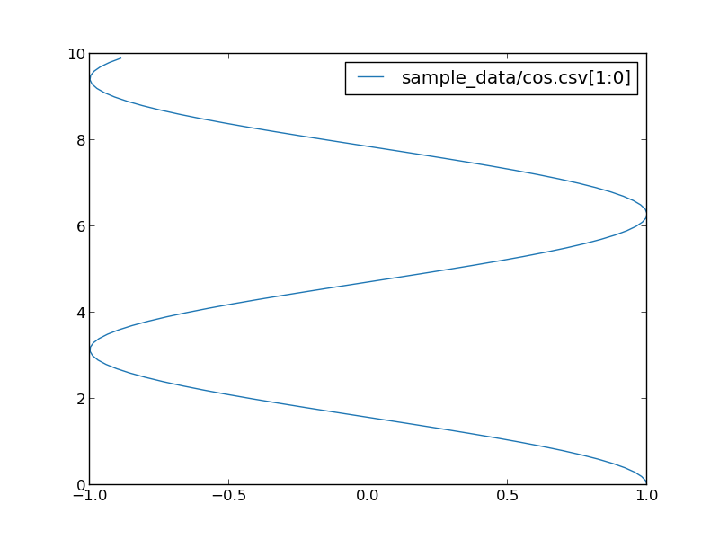
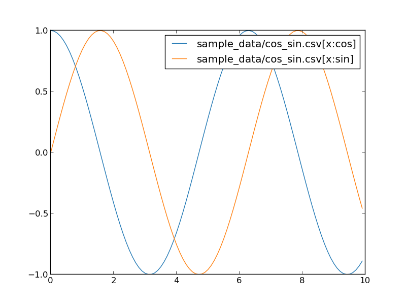

Plot one csv file
=================

You can simply plot your csv file without any option.
```
pltcli sin.csv
```

sin.csv looks like::
```csv
x,y
0.0,0.0
0.1,0.09983341664682815
0.2,0.19866933079506122
0.30000000000000004,0.2955202066613396
0.4,0.3894183423086505
0.5,0.479425538604203
0.6000000000000001,0.5646424733950355
0.7000000000000001,0.6442176872376911
0.8,0.7173560908995228
0.9,0.7833269096274834
```

And you can get following chart:


Plot multiple csv files
=======================
You can plot multiple csv files.
```
pltcli sample_data/sin.csv sample_data/cos.csv
```


Specify fields to plot
======================
You can specify fields for x and y axis by `filename[x:y]`.

```
pltcli sample_data/cos.csv[1:0]
```



If your csv file has *index line* at the first line, you can use the index
for fields.

```
pltcli sample_data/cos_sin.csv[x:cos] sample_data/cos_sin.csv[x:sin]
```



cos_sin.csv looks like:

```csv
x,cos,sin
0.0,1.0,0.0
0.1,0.9950041652780258,0.09983341664682815
0.2,0.9800665778412416,0.19866933079506122
0.30000000000000004,0.955336489125606,0.2955202066613396
0.4,0.9210609940028851,0.3894183423086505
...
```

You can use `,` character to specify multiple field set in one argument.
`pltcli cos_sin.csv[x:cos,x:sin]` is equivalent to `pltcli cos_sin.csv[x:cos] cos_sin.csv[x:sin]`.
