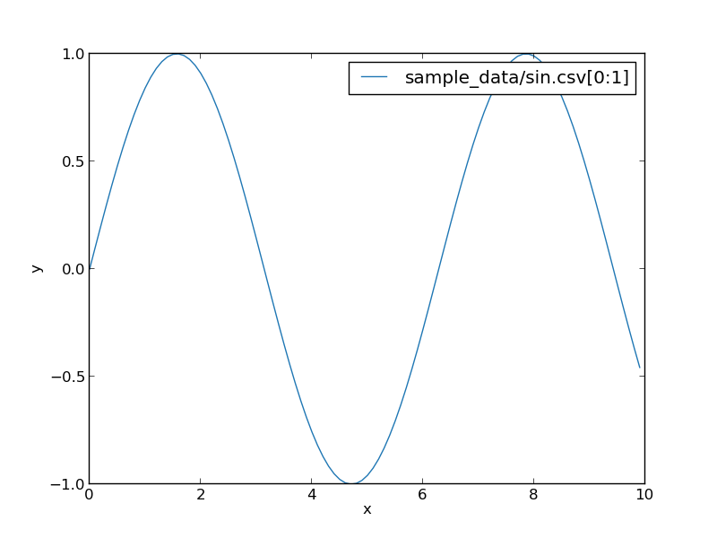
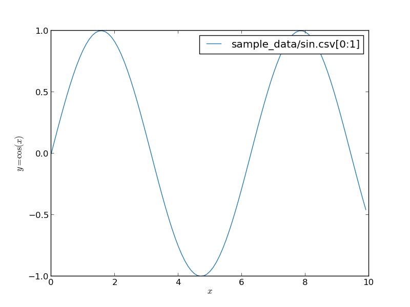

Specify x and y axis titles
===========================

You can specify titles on x and y axis by `--x-title` and `--y-title` option.

```
pltcli sample_data/sin.csv --x-title x --y-title y
```


Titles with TeX literal
===========================
You can use tex format when you specify title with "$...$" block.

```
pltcli sample_data/sin.csv --x-title $x$ --y-title $y=\cos(x)$
```

