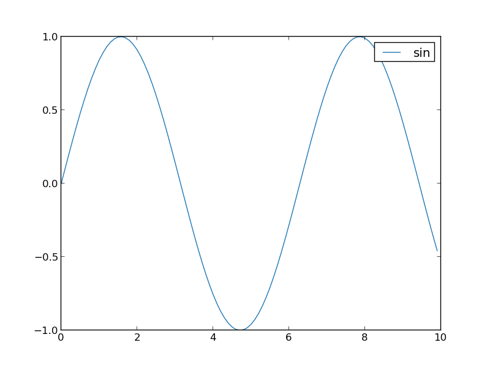
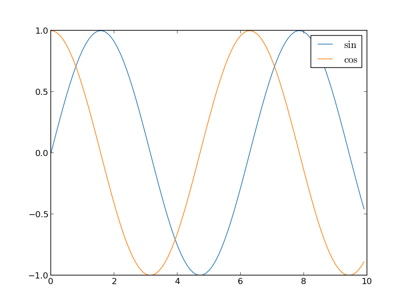
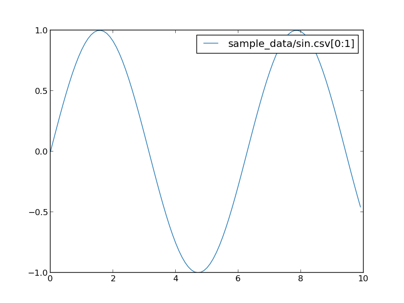
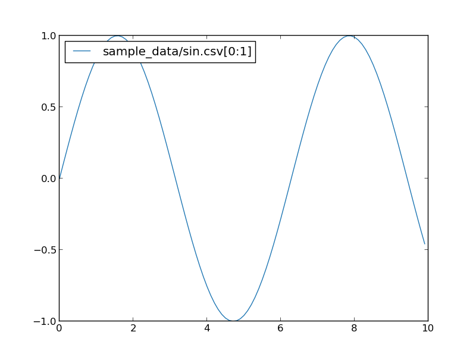
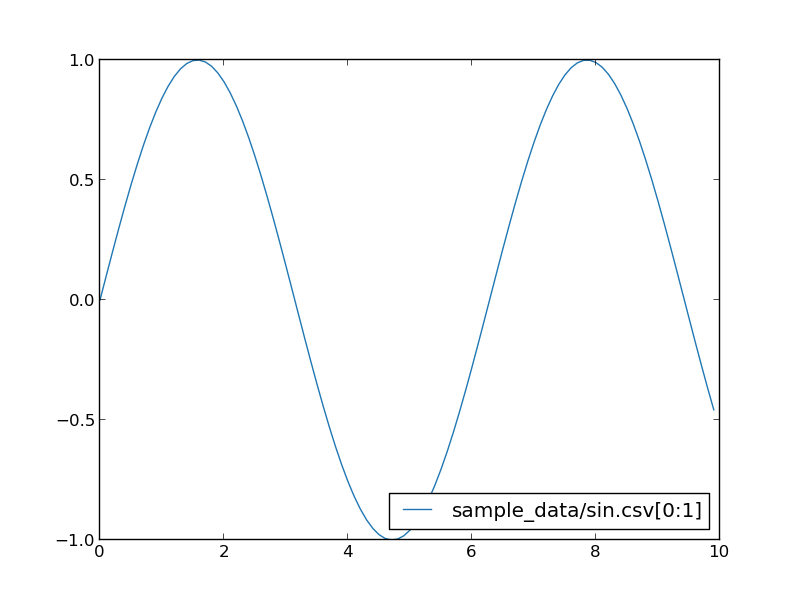
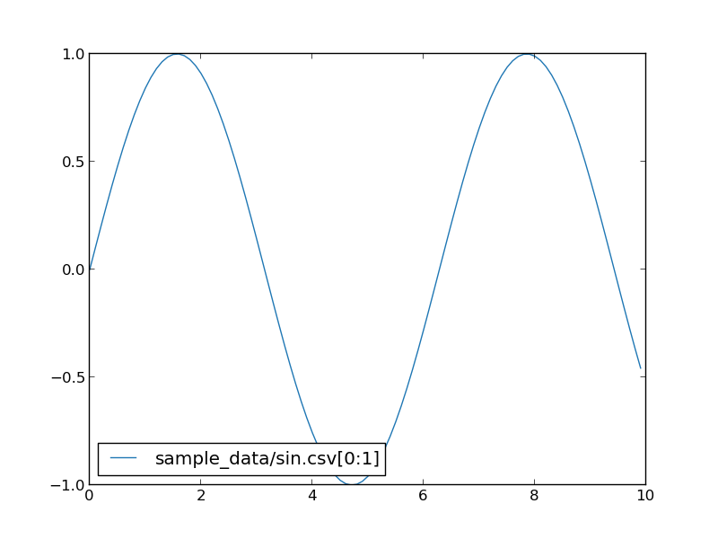

Specify labels on legend
========================

In default, `pltcli` use input filename as legend labels.
You can use `--label` option to specify them.

```
pltcli sample_data/sin.csv --label sin
```



When you plotting multiple csv files, you need to specify labels as many as input files.

```
pltcli sample_data/sin.csv sample_data/cos.csv --label sin --label cos
```


You can use tex literal in label as well as titles.

```
pltcli sample_data/sin.csv sample_data/cos.csv --label $\sin$ --label $\cos$
```



Position of legends
========================
You can specify position of legend with `--legend-pos` option.
`--legend-pos` option takes one of `lu`, `ru`, `ll` and `rl`.
`l` and `r` means left and right and `u` and `l` means upper and lower.
Default is `ru`.


```
pltcli sample_data/sin.csv --legend-pos ru
```



```
pltcli sample_data/sin.csv --legend-pos lu
```




```
pltcli sample_data/sin.csv --legend-pos rl
```



```
pltcli sample_data/sin.csv --legend-pos ll
```


