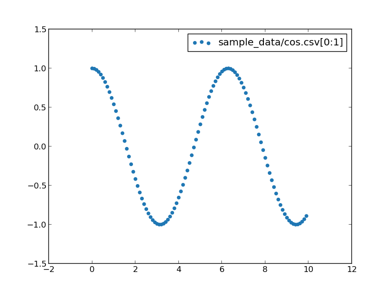
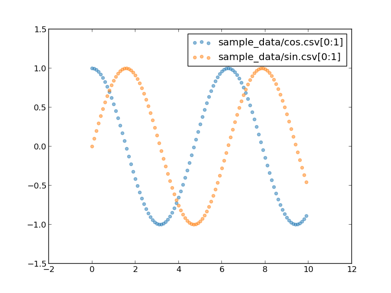

Plot scatter charts
===================

You can plot scatter charts using `--type scatter`.

```
pltcli --type scatter sample_data/cos.csv
```



You can use `--alpha` to specify transparency.

```
pltcli --type scatter sample_data/cos.csv sample_data/sin.csv --alpha 0.5
```


