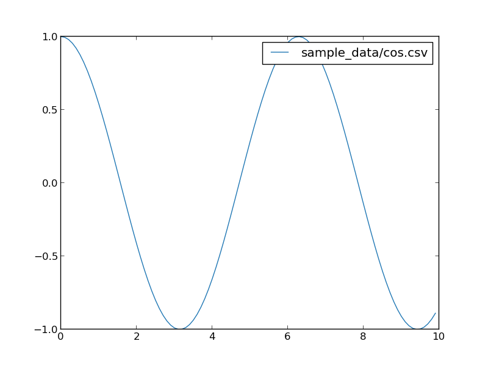

# pltcli


pltcli is a command line tool to plot your data written in csv based on [matplotlib](https://matplotlib.org).

Our goal is to provide good tool to plot your data without any coding.

```
$ pltcli --help
usage: pltcli [-h] [--type TYPE] [--label LABEL] [--x-title X_TITLE]
              [--y-title Y_TITLE] [--show-grid] [--color-theme COLOR_THEME]
              [--output OUTPUT] [--sort-x] [--tight] [--legend-pos LEGEND_POS]
              files [files ...]

positional arguments:
  files                 csv files to plot.

optional arguments:
  -h, --help            show this help message and exit
  --type TYPE, -t TYPE  Chart type. default is line
  --label LABEL         Labels of files which are used in legends.
  --x-title X_TITLE     title on x axis
  --y-title Y_TITLE     title on y axis
  --show-grid           Show grid
  --color-theme COLOR_THEME
                        color theme
  --output OUTPUT, -o OUTPUT
                        output to image file
  --sort-x              sort x values
  --tight               set range of x and y strictly from dataset
  --legend-pos LEGEND_POS
                        position of legend (ru, lu, rl, ll)
```

## TODOs
* Scatter charts
* Heatmap charts
* 3-D plot
* Histogram charts
* Simple fitting
* Specify column to plot
* pypi package
